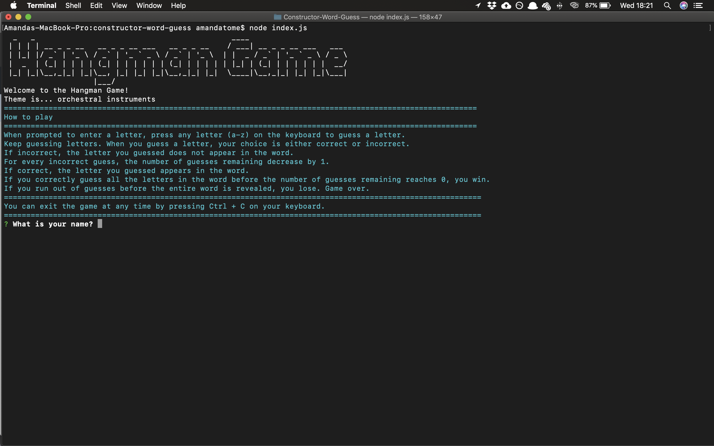

# Constructor-Word-Guess



## Repository 
https://github.com/amandat85/Constructor-Word-Guess

## Languages, Tools and Techologies
* JavaScript
* Node.js
* NPM
* Figlet
* Chalk
* Inquirer

 ## Setup Files
 To play the Constructor Word Guess Game you will need to se up certain files.

 1. Clone/download the repository from the following github page: https://github.com/amandat85/Constructor-Word-Guess
 2. Create a .gitignore file. In this .gitignore file add the following file names:
    ```
    .DS_Store
    node_modules
    ```
## Setup Node and NPM
5. Check that you have node.js and node package manager (npm) installed. To do this open the terminal and type `node -v` and then `npm -v`. If a version number shows up, you have it installed. If nothing shows up then you need to do some installations. To install node.js and npm you can simply install node and it will take care of both: https://nodejs.org/en/
6. Next, navigate to the directory holding the cloned or downloaded LIRI repository.
7. When in th repository directory run `npm install`
8. This should install the following node modules and their dependencies:
    * chalk
    * figlet
    * inquirer

You should now be ready to run the application.

## How it works

Please watch this video demo of the application: https://drive.google.com/file/d/1c3ewiuApWLFvETjGFLH8JgzDF3JdhzVa/view

1. When the application begins, you will be prompted to enter your name and to select whether you wish to play.

2. If yes, then you will be prompted to guess a letter. You will do this until you guess the word or you run out of guesses.

3. At the end of each of the above scenarios, you will be asked if you would like to play again.

4. If yes, you will be asked to guess another letter and so on. If no. you will exit the application.

5. You can exit the application at any time by pressing Ctrl + C

## License
MIT


